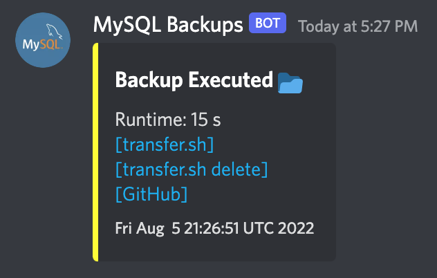

# Custom MySQL Backup

## Description
This project is a personal extension of an amazing piece of software [Databacker's MySQL Backup](https://github.com/databacker/mysql-backup). This project only adds additional libraries into the contain which allow for popular cli resources like [curl](https://curl.se/) and [jq](https://stedolan.github.io/jq/). The addition of these libraries is to extend [Pre- and Post- Processing](https://github.com/databacker/mysql-backup#backup-pre-and-post-processing) included in the original project.

## Running with Docker-Compose
**TOP NOTE**: Ensure you run `sudo chmod -R 777` on the `post-backup` folder.

### Be sure to fill in these variables:

| Variable | Description |
|---|---|
| DB_SERVER | The host of the MySQL DB. |
| DB_USER | The username of DB credentials. |
| DB_PASS | The password of the DB user account. |
| DB_DUMP_FREQ | Frequency in minutes. |
| SP_ENABLE_ENCRYPTION | To enable the upload process encryption. |
| SP_ENCRYPTION_KEY | The encryption key to use. |
| SP_ENABLE_TRANSFER | Toggle save to transfer.sh |
| SP_GH_PK | Use a Github Personal Access Token to enable upload to Github. |
| SP_GH_USER | The username of the Access Token when using Github upload. |
| SP_GH_REPO | The repo to use when creating backup releases. |
| SP_DISCORD_USER | Enables a direct ping when using Discord alering |
| SP_DISCORD_WEBHOOK | Can alert via Discord the URLs of the backup if connected. |

### An example of the Discord alert
